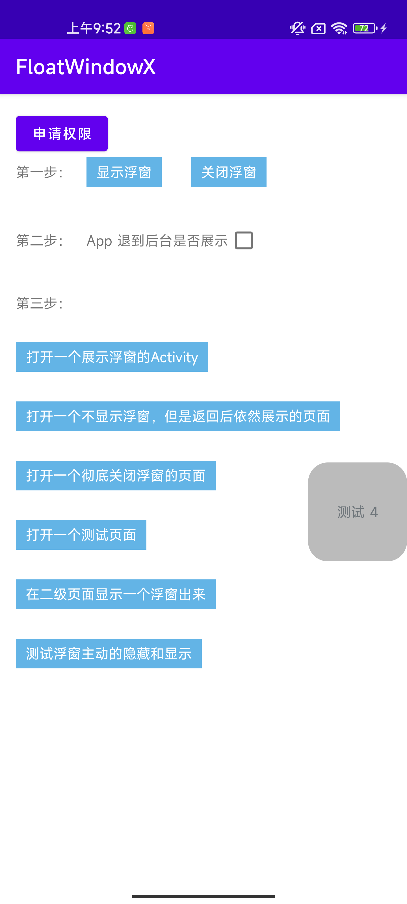

## 开箱即用的 Android 悬浮窗  FloatWindowX 



#### 需要权限

```java
<uses-permission android:name="android.permission.SYSTEM_ALERT_WINDOW" />
<uses-permission android:name="android.permission.ACTION_MANAGE_OVERLAY_PERMISSION" />
```

#### 请在 Application 初始化

```
  FloatX.get().init(App.get());
```


#### 最简单的使用

```java

// floatView 自己来构造就可
FloatConfig floatConfig = new FloatConfig(floatView);

FloatX.get()
       .addFloat(floatConfig)
       .show(flag);
```


#### 高级一点

```java
// 不需要展示的页面(进入这些页面不需要展示，但是退出后需要继续展示)
.setNotDisplayActivities(notDisplayActivities)
// 需要关闭的页面(一旦进入这些页面，就彻底销毁悬浮窗了。退出也不会展示，只有再次创建才可以)
.setCloseActivities(mCloseActivities)
// 【默认为不展示】是否需要在桌面也显示浮窗
.setDesktopShow(mDesktopShow.isChecked());


// 松手时动画
floatConfig.setTouchActionUpListener(new TouchActionUpListener() {
@Override
 public boolean actionUp(@Nullable FloatViewController controller, float rawX, float rawY) {
      // 如果业务的松手时动画有自己的需求，就在这里返回 true。然后实现自己的动画就好。
      // controller.updateViewLocation(x,y); 可以改变 view 的位置。其他的 api 能不调就别调
       return false;
  }
});
```

#### 直接使用可以下载项目根目录下的 arr 文件夹中的 aar 包。


## License

```
随便用
```
